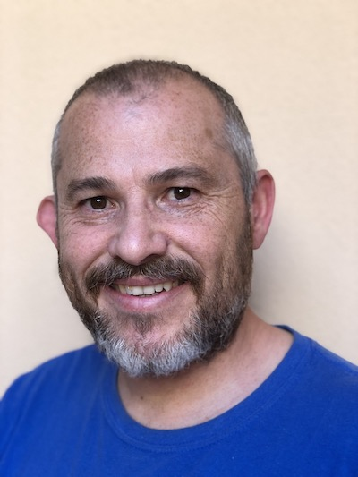

# Diego Freniche Brito - Mobile Apps Developer, sometimes Teacher

## Contact info

- Social:
	- Twitter: [https://twitter.com/dfreniche](https://twitter.com/dfreniche)
	- LinkedIn: [http://es.linkedin.com/in/dfreniche](http://es.linkedin.com/in/dfreniche)
	- Github: [https://github.com/dfreniche](https://github.com/dfreniche)
	- StackOverflow: [http://stackoverflow.com/users/225503/diego-freniche](http://stackoverflow.com/users/225503/diego-freniche)

- Blog: [http://www.freniche.com](http://www.freniche.com)

- Current location: 
	- ☀️ El Saucejo, Seville (Spain)
	- 🌍 Travelling sometimes

---

## Current Position

(Jan 2018 - ) __Senior Mobile developer at [Teamwork.com](https://www.teamwork.com)__. 

For two years I've been maintaining the existing Projects & Desk Mobile Apps, written in CoffeeScript / Titanium Appcelerator. Technologies used: 

- Node.js
- CoffeeScript
- Axway Appcelerator
- Swift / Java (for the native modules and extensions)
- gulp, bash, Ruby for the tooling

Right now I've been helping with the native/Swift Chat App and currently I'm working on the new native iOS App for Teamwork, using:

- Xcode (off course)
- RxSwift
- Realm
- Cocoa Pods
- Bitrise as CI
- SwiftLint
- Sourcery 

---

## Past experience

- Mobile Developer at [Mobile Jazz](http://www.mobilejazz.com):
	- crafting Android & iOS Apps in Swift / Objective-C

- Freelance:
    - developing Apps in a contract-based basis 
    - __teaching__ public & private sector customers how to develop __iOS & Android__ Apps. I teach in Spanish & English, mainly inside Spain but also in other countries.
    
- IT Service Manager at [Isotrol](https://www.isotrol.com)
August 2008 – December 2009 (1 year 5 months)
	- in charge of a team of 8 System Admins
	- organizing, developing, maintaining all the IT infrastructure for a +250 organization

- Resp. of in-house training at [Isotrol](https://www.isotrol.com)
January 2007 – August 2008 (1 year 8 months)
	- working with HR, create and execute a training plan using both private and public funds.
	- execute +14000 training hours / year

- Consultant at [Incyde](http://www.incyde.org)
2005 – 2006 (1 year)
	- working with SMEs, helping in their IT needs with a clear focus in making more money with IT

- Teacher (Linux & Java) as a Freelance January 2000 – November 2006 (6 years 11 months)
	- Creating courses agendas and materials. Organizing travels. Teaching people.

- Freelance Writer at PCWorld España
June 2004 – January 2005 (8 months)

- Freelance Team Manager at Telefonica Soluciones
November 2002 – August 2003 (10 months)
	- forming a team to develop complex web pages for mayor Town Halls in Spain

- Founder at Elelog, S.L. at 2000 – 2003 (3 years)

- Programmer at [Isotrol](https://www.isotrol.com)
September 1997 – August 1999 (2 years)

- Computer technician / VB Programmer at Teknoservice, S.L.
1997 – 1998 (1 year)

## Skills

- __Strong IT knowledge__: I love Computer Science. Always learning. Always trying to improve, both personal and profesionally. 
	- Programming languages I've used in chronological order: BASIC, PASCAL, C, C++, Clipper, Delphi, VB6, Java, Objective-C, JavaScript
	- Also have a good foundation using UNIX operating systems: been using Linux since 1994, OS X since 2008. Have been runnig a small data center (120 servers) at Isotrol. 
- Outstanding communication skills both oral & written. Thanks to an extensive training & speaking experience (+12 years) and constant learning. I'm used to talk in public. 
- Team building: I've been forming/leading teams all my career.

## Public speaking

- Speaker at [AltConf Madrid 2019](http://madrid.altconf.com/schedule/)
- Speaker at [iOSDevUK 2016](https://static1.squarespace.com/static/5463eca4e4b09c644a61f99a/t/57cfb800be6594f9111145d3/1473230850921/v1.2+iOSDevUK+2016+Programme.pdf)
- Speaker at [Seville Developers Conference](http://www.sevilladevelopers.com/schedule/#session-1)
- Speaker at [iOSDevUK 2014](https://www.conferize.com/conferences/iosdevuk-2014/speakers)
- Speaker (two workshops, iOS) and Android) at the Gran Canaria TIC (GCTIC) Forum
- Speaker at the [WipJam - MWC 2014](http://wipjammwc14.sched.org/event/c80b40922c7abb24aa768388f60fa5b6#.UwYllnneMWa)
- Speaker at the [NSSpain international conference, Sept 2013](http://nsspain.com/2013/speakers/)
- Speaker at the [BCNDevCon conference, Dec 2012](http://2012.bcndevcon.org/master-sessions/C-mo-entrar-en-el-comercio-m-vil)
- Founder of the NSCoder Night Seville meeting group of Cocoa developers
- Regular appearances at the Spanish development podcast [We.Developers](http://wedevelopers.com)

## Publications

- Writer at [MacWorld Spain](http://dialnet.unirioja.es/servlet/autor?codigo=889530)
- Writer at PCWorld Spain (topic: Linux)
- Some code at bitbucket (migrating into Github): [https://bitbucket.org/dfreniche]()
- A few episodes of my videocast (old Xcode 4 stuff, sorry): [http://www.cafeycocoa.com.es]() 

## Customer Apps published

- Other Apps created, but under NDA terms...
- Neurology Interpreter Translator-Spanish (iOS App) [Link](https://itunes.apple.com/us/app/neusp/id527846682?mt=8)
- Neurology Interpreter Chinese audio (NEU Ch) [Link](https://itunes.apple.com/us/app/neurology-interpreter-chinese/id533153381?mt=8)
- Neurology Interpreter Spanish Android App [Link](https://play.google.com/store/apps/details?id=com.femtocoders.neusp&hl=en#!)

## Industry certifications

- SCJP 1.6 (Sun Certified Java Programmer) / Oracle
- SCJP 1.5 (Sun Certified Java Programmer) / Oracle
- SCWCD 1.5 (Sun Certified Web Component Developer) 
- SCBCD 1.3 (Sun Certified Business Component Developer) 
- ITIL Foundation v2 OGC / APM Group

## Education

University of Seville - Bachelor on Computer Science (Informática SS.FF.)

---
